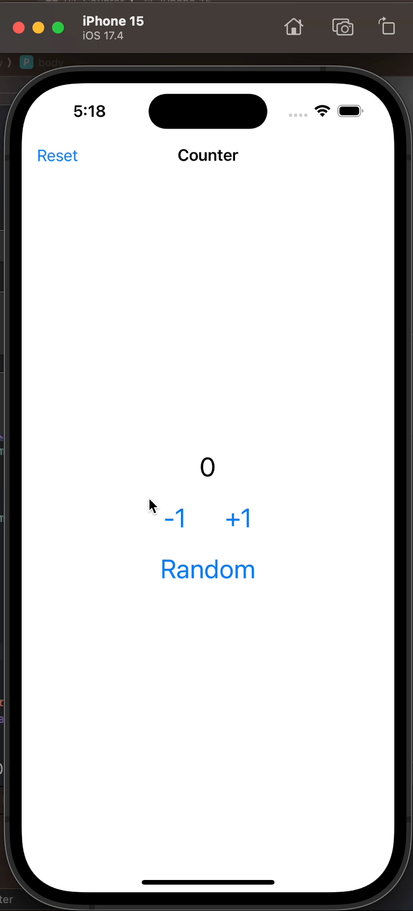
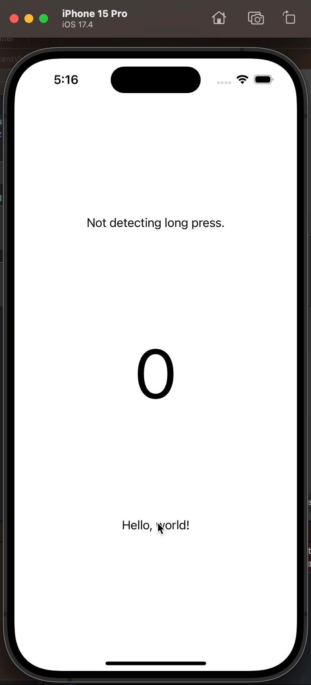

# Swift Everyday

Or just some of the day

---

Inspired by [30DaysofSwift](https://github.com/allenwong/30DaysofSwift?tab=readme-ov-file) & [Sam Lu - 100 Days of Swift](https://samvlu.com/index.html)
& [30-days-of-swiftui](https://github.com/FradSer/30-days-of-swiftui)

---

[01 - Just Counter](https://github.com/wlcharlie/swift-everyday/tree/main/P1-Counter)

- mutating keyword usage and @State property wrapper
- Int.random
- NavigationStack, .navigationTitle, .navigationBarTitleDisplayMode, .toolbar, ToolbarItem

[02 - Long Press](https://github.com/wlcharlie/swift-everyday/tree/main/P2-LongPress)

- LongPressGesture & onLongPressGesture
- Timer
- ObservableObject, @Published, @ObservedObject
